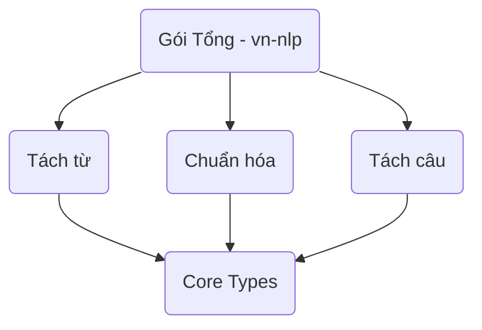

# Kiến Trúc Thư Viện (Architecture)

Thư viện `vn-nlp` được thiết kế dưới dạng không gian làm việc (Workspace) phân thành nhiều gói nhỏ bé thay vì 1 cục nguyên khối (Monolith).

## Cấu trúc Crate

Workspace bao gồm các module chính nằm bên trong thư mục `crates/`:
- `vn-nlp`: Thư viện lõi tổng hợp sử dụng để public. Nếu bạn dùng Library, bạn chỉ cần liên kết với crate này.
- `vn-nlp-core`: Phần core, cung cấp các Types, Trait căn bản như Token, FeatureEnum... được dùng chung cho tất cả các crate nhỏ lẻ.
- `vn-nlp-tokenize`: Engine xử lý tách từ vựng tiếng Việt (Word Segmentation).
- `vn-nlp-normalize`: Engine xử lý chuẩn hóa font chữ (Unicode NFC, NFD) và xóa dấu câu.
- `vn-nlp-segment`: Xử lý phân đoạn ranh giới câu (Sentence Segmentation).
- `vn-nlp-wasm`: Wrapper sinh WebAssembly, để chạy Javascript trên Front-end Web.
- `vn-nlp-python`: Cung cấp PyO3 wrapper tích hợp thư viện này vào hệ sinh thái Khoa Học Dữ Liệu Python.

## Mối Qua Hệ Dependencies (Mô Hình)

## Performance & Đánh Giá

Với cách chia để trị, Cargo có thể tính toán để tối hưu hóa chỉ dịch những crate thay đổi code. 
- Giảm thiểu kích thước Binary build ra.
- Tốc độ chạy rất nhanh vì dữ liệu Token không sinh ra object mới đè trong bộ nhớ (Zero-copy Strings lifetime).
